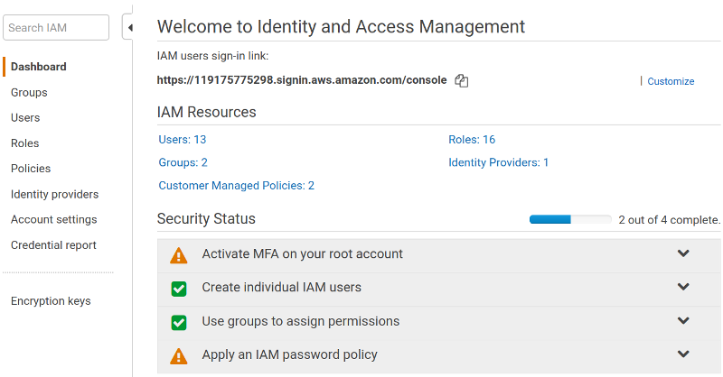
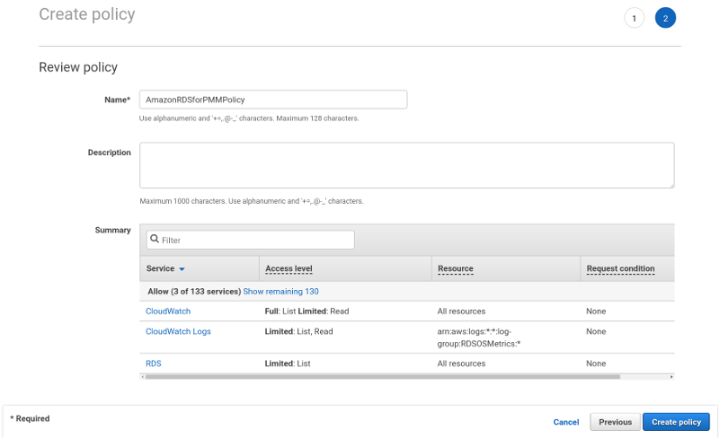
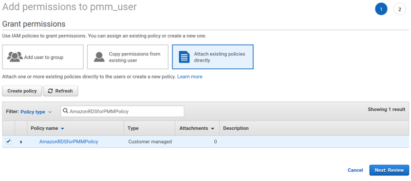

# Adding an Amazon RDS DB instance to PMM

The *PMM Add Instance* is now a preferred method of adding an Amazon RDS DB instance to PMM. This method supports Amazon RDS DB instances that use Amazon Aurora, MySQL, or MariaDB engines.

[TOC]


*Enter the access key ID and the secret access key of your IAM user to view Amazon RDS DB instances.*

1. Open the PMM web interface and select the *PMM Add Instance* dashboard.
2. Select the Add an AWS RDS MySQL or Aurora MySQL Instance option in the dashboard.
3. Enter the access key ID and the secret access key of your IAM user.
4. Click the Discover button for PMM to retrieve the available Amazon RDS instances.


For each instance that you would like to monitor, select the Enabled button and enter the user name and password. Click Connect. You can now monitor your instances in the *Amazon RDS / Aurora MySQL Metrics*.


## Essential AWS settings for monitoring Amazon RDS DB instances in PMM

It is possible to use PMM for monitoring Amazon RDS (just like any remote MySQL instance). In this case, the PMM Client is not installed on the host where the database server is deployed. By using the PMM web interface, you connect to the Amazon RDS DB instance. You only need to provide the IAM user access key (or assign an IAM role) and PMM discovers the Amazon RDS DB instances available for monitoring.

First of all, ensure that there is the minimal latency between PMM Server and the Amazon RDS instance.

Network connectivity can become an issue for Prometheus to scrape metrics with 1 second resolution.  We strongly suggest that you run PMM Server on  in the same availability zone as Amazon RDS instances.

It is crucial that *enhanced monitoring* be enabled for the Amazon RDS DB instances you intend to monitor.


### Creating an IAM user with permission to access Amazon RDS DB instances

It is recommended that you use an IAM user account to access Amazon RDS DB instances instead of using your AWS account. This measure improves security as the permissions of an IAM user account can be limited so that this account only grants access to your Amazon RDS DB instances. On the other hand, you use your AWS account to access all AWS services.

The procedure for creating IAM user accounts is well described in the Amazon RDS documentation. This section only goes through the essential steps and points out the steps required for using Amazon RDS with Percona Monitoring and Management.

The first step is to define a policy which will hold all the necessary permissions. Then, you need to associate this policy with the IAM user or group. In this section, we will create a new user for this purpose.

### Creating a policy

A policy defines how AWS services can be accessed. Once defined it can be associated with an existing user or group.

To define a new policy use the IAM page at AWS.



1. Select the Policies option on the navigation panel and click the Create policy button.

2. On the Create policy page, select the JSON tab and replace the existing contents with the following JSON document.

    ```
    { "Version": "2012-10-17",
      "Statement": [{ "Sid": "Stmt1508404837000",
                      "Effect": "Allow",
                      "Action": [ "rds:DescribeDBInstances",
                                  "cloudwatch:GetMetricStatistics",
                                  "cloudwatch:ListMetrics"],
                                  "Resource": ["*"] },
                     { "Sid": "Stmt1508410723001",
                       "Effect": "Allow",
                       "Action": [ "logs:DescribeLogStreams",
                                   "logs:GetLogEvents",
                                   "logs:FilterLogEvents" ],
                                   "Resource": [ "arn:aws:logs:*:*:log-group:RDSOSMetrics:*" ]}
                   ]
    }
    ```


3. Click Review policy and set a name to your policy, such as *AmazonRDSforPMMPolicy*. Then, click the Create policy button.

    

    *A new policy is ready to be created.*

### Creating an IAM user

Policies are attached to existing IAM users or groups. To create a new IAM user, select Users on the Identity and Access Management page at AWS. Then click Add user and complete the following steps:


1. On the Add user page, set the user name and select the Programmatic access option under Select AWS access type. Set a custom password and then proceed to permissions by clicking the Permissions button.

2. On the Set permissions page, add the new user to one or more groups if necessary. Then, click Review.

3. On the Add user page, click Create user.

### Creating an access key for an IAM user

In order to be able to discover an Amazon RDS DB instance in PMM, you either need to use the access key and secret access key of an existing IAM user or an IAM role. To create an access key for use with PMM, open the IAM console and click Users on the navigation pane. Then, select your IAM user.

To create the access key, open the Security credentials tab and click the Create access key button. The system automatically generates a new access key ID and a secret access key that you can provide on the *PMM Add Instance* dashboard to have your Amazon RDS DB instances discovered.

!!! important
    You may use an IAM role instead of IAM user provided your Amazon RDS DB instances are associated with the same AWS account as PMM.

In case, the PMM Server and Amazon RDS DB instance were created by using the same AWS account, you do not need create the access key ID and secret access key manually. PMM retrieves this information automatically and attempts to discover your Amazon RDS DB instances.

### Attaching a policy to an IAM user

The last step before you are ready to create an Amazon RDS DB instance is to attach the policy with the required permissions to the IAM user.

First, make sure that the Identity and Access Management page is open and open Users. Then, locate and open the IAM user that you plan to use with Amazon RDS DB instances. Complete the following steps, to apply the policy:

1. On the Permissions tab, click the Add permissions button.

2. On the Add permissions page, click Attach existing policies directly.

3. Using the Filter, locate the policy with the required permissions (such as *AmazonRDSforPMMPolicy*).

4. Select a checkbox next to the name of the policy and click Review.

5. The selected policy appears on the Permissions summary page. Click Add permissions.

The *AmazonRDSforPMMPolicy* is now added to your IAM user.



### Setting up the Amazon RDS DB Instance

Query Analytics requires Configuring Performance Schema as the query source, because the slow query log is stored on the  side, and QAN agent is not able to read it.  Enable the `performance_schema` option under `Parameter Groups` in Amazon RDS.

!!! warning
    Enabling Performance Schema on T2 instances is not recommended because it can easily run the T2 instance out of memory.

When adding a monitoring instance for Amazon RDS, specify a unique name to distinguish it from the local MySQL instance.  If you do not specify a name, it will use the client’s host name.

Create the `pmm` user with the following privileges on the Amazon RDS instance that you want to monitor:

```
GRANT SELECT, PROCESS, REPLICATION CLIENT ON *.* TO 'pmm'@'%' IDENTIFIED BY 'pass' WITH MAX_USER_CONNECTIONS 10;
GRANT SELECT, UPDATE, DELETE, DROP ON performance_schema.* TO 'pmm'@'%';
```

If you have Amazon RDS with a MySQL version prior to 5.5, REPLICATION CLIENT privilege is not available there and has to be excluded from the above statement.

!!! note
    General system metrics are monitored by using the **rds_exporter** Prometheus exporter which replaces **node_exporter**. **rds_exporter** gives access to Amazon Cloudwatch metrics.

    **node_exporter**, used in versions of PMM prior to 1.8.0, was not able to monitor general system metrics remotely.

!!! seealso "See also"
    Amazon RDS Documentation:
    - [Creating an IAM user](https://docs.aws.amazon.com/AmazonRDS/latest/UserGuide/CHAP_SettingUp.html#CHAP_SettingUp.IAM)
    - [Creating IAM policies](https://docs.aws.amazon.com/IAM/latest/UserGuide/access_policies_create.html)
    - [Managing access keys of IAM users](https://docs.aws.amazon.com/IAM/latest/UserGuide/id_credentials_access-keys.html)
    - [Modifying an Amazon RDS DB Instance](https://docs.aws.amazon.com/AmazonRDS/latest/UserGuide/Overview.DBInstance.Modifying.html)
    - [More information about enhanced monitoring](https://docs.aws.amazon.com/AmazonRDS/latest/UserGuide/USER_Monitoring.OS.html)
    - [Setting Up](https://docs.aws.amazon.com/AmazonRDS/latest/UserGuide/CHAP_SettingUp.html)
    - [Getting started](https://docs.aws.amazon.com/AmazonRDS/latest/UserGuide/CHAP_GettingStarted.html)
    - [Creating a MySQL DB Instance](https://docs.aws.amazon.com/AmazonRDS/latest/UserGuide/CHAP_GettingStarted.CreatingConnecting.MySQL.html)
    - [Connecting to a DB instance (MySQL engine)](https://docs.aws.amazon.com/AmazonRDS/latest/UserGuide/USER_ConnectToInstance.html)
    - [Availability zones](https://docs.aws.amazon.com/AWSEC2/latest/UserGuide/using-regions-availability-zones.html)
    - [What privileges are automatically granted to the master user of an Amazon RDS DB instance?](https://docs.aws.amazon.com/AmazonRDS/latest/UserGuide/UsingWithRDS.MasterAccounts.html)

   Which ports should be open?
   : See [Ports](glossary.terminology.md#ports) in glossary
