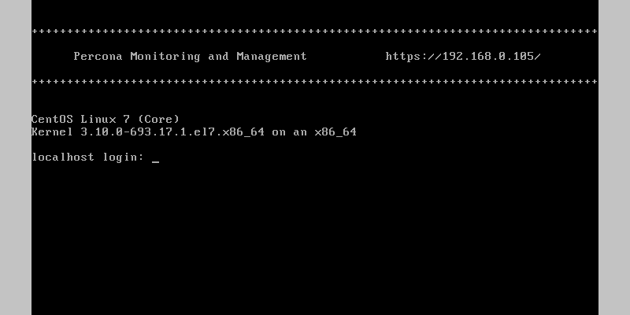
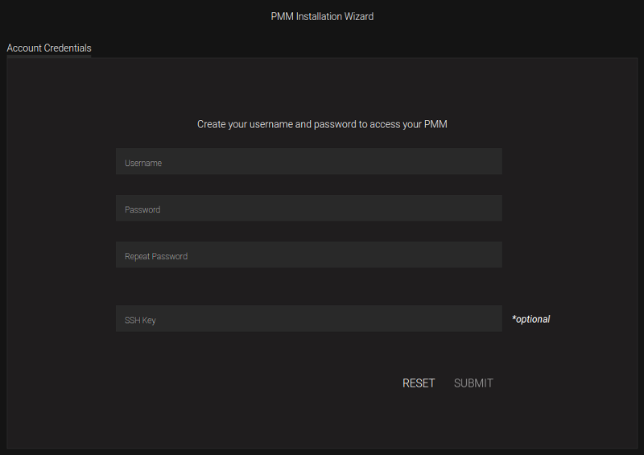

# PMM Server as a Virtual Appliance

Percona provides a *virtual appliance* for running PMM Server in a virtual machine.  It is distributed as an *Open Virtual Appliance* (OVA) package, which is a **tar** archive with necessary files that follow the *Open Virtualization Format* (OVF).  OVF is supported by most popular virtualization platforms, including:

* [VMware - ESXi 6.5](https://www.vmware.com/products/esxi-and-esx.html)
* [Red Hat Virtualization](https://www.redhat.com/en/technologies/virtualization)
* [VirtualBox](https://www.virtualbox.org/)
* [XenServer](https://www.xenserver.org/)
* [Microsoft System Center Virtual Machine Manager](https://www.microsoft.com/en-us/cloud-platform/system-center)

In this chapter

[TOC]

## Supported Platforms for Running the PMM Server Virtual Appliance

You can download the PMM Server OVF image from the [PMM download page](https://www.percona.com/downloads/pmm/). Choose the appropriate PMM version and the *Server - Virtual Appliance (OVF)* item in two pop-up menus to get the download link.

The virtual appliance is ideal for running PMM Server on an enterprise virtualization platform of your choice. This page explains how to run the appliance in VirtualBox and VMware Workstation Player. which is a good choice to experiment with PMM at a smaller scale on a local machine.  Similar procedure should work for other platforms (including enterprise deployments on VMware ESXi, for example), but additional steps may be required.

The virtual machine used for the appliance runs CentOS 7.

!!! warning
    The appliance must run in a network with DHCP, which will automatically assign an IP address for it.

    To assign a static IP manually, you need to acquire the root access as described in How to set the root password when PMM Server is installed as a virtual appliance. Then, see the documentation for the operating system for further instructions: [Configuring network interfaces in CentOS](https://www.centos.org/docs/5/html/Deployment_Guide-en-US/s1-networkscripts-interfaces.html)

### Instructions for setting up the virtual machine for different platforms

* [VirtualBox Using the Command Line](ova.virtualbox.cli.md)
* [VirtualBox Using the GUI](ova.virtualbox.gui.md)
* [VMware Workstation Player](ova.vmware-workstation-player.md)

## Identifying PMM Server IP Address

When run PMM Server as virtual appliance, The IP address of your PMM Server appears at the top of the screen above the login prompt. Use this address to access the web interface of PMM Server.

PMM Server uses DHCP for security reasons, and thus you need to check the PMM Server console in order to identify the address.  If you require configuration of a static IP address, see
[Configuring network interfaces in CentOS](https://www.centos.org/docs/5/html/Deployment_Guide-en-US/s1-networkscripts-interfaces.html)

## Accessing PMM Server

To run the PMM Server, start the virtual machine and open in your browser the URL that appears at the top of the terminal when you are logging in to the virtual machine.



If you run PMM Server in your browser for the first time, you are requested to supply the user and a new password. Optionally, you may also provide your SSH public key.



Click Submit and enter your user name and password in the dialog window that pops up. The PMM Server is now ready and the home page opens.


You are creating a username and password that will be used for two purposes:

1. authentication as a user to PMM - this will be the credentials you need in order to log in to PMM.

2. authentication between PMM Server and PMM Clients - you will re-use these credentials when configuring pmm-client for the first time on a server, for example:

    Run this command as root or by using the **sudo** command

    ```
    $ pmm-admin config --username= --password= --server=1.2.3.4
    ```

## Accessing the Virtual Machine

To access the VM with the *PMM Server* appliance via SSH, provide your public key:

1. Open the URL for accessing PMM in a web browser.

    The URL is provided either in the console window or in the appliance log.

2. Submit your **public key** in the PMM web interface.

After that you can use `ssh` to log in as the `admin` user. For example, if *PMM Server* is running at 192.168.100.1 and your **private key** is `~/.ssh/pmm-admin.key`, use the following command:

```
ssh admin@192.168.100.1 -i ~/.ssh/pmm-admin.key
```

## Next Steps

Verify that PMM Server is running by connecting to the PMM web interface using the IP address assigned to the virtual appliance, then install PMM Client on all database hosts that you want to monitor.
