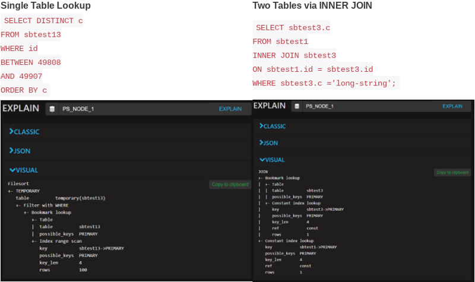
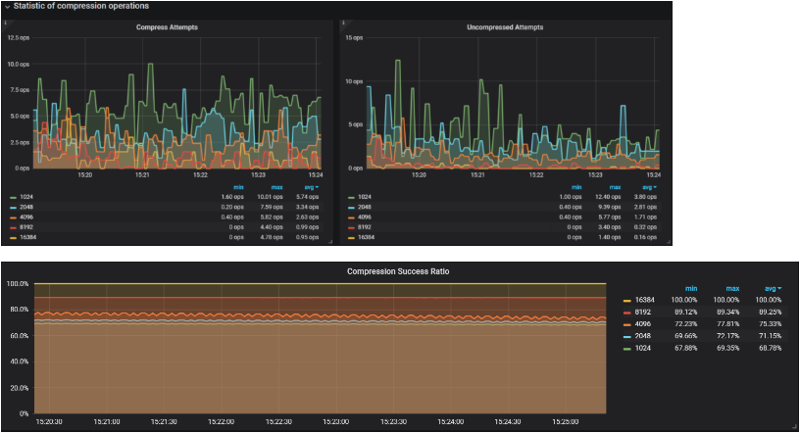
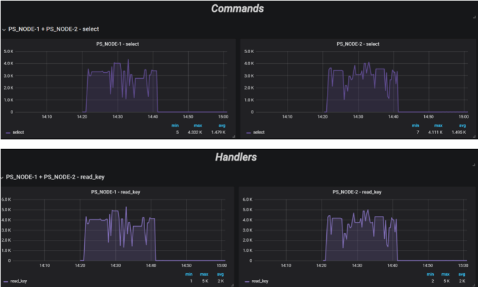

# Percona Monitoring and Management 1.12.0

* **Date**

    June 27, 2018

In release 1.12, we invested our efforts in the following areas:

Visual Explain in Query Analytics – Gain insight into MySQL’s query optimizer for your queries New Dashboard – InnoDB Compression Metrics – Evaluate effectiveness of InnoDB Compression New Dashboard – MySQL Command/Handler Compare – Contrast MySQL instances side by side Updated Grafana to 5.1 – Fixed scrolling issues We addressed 10 new features and improvements, and fixed 13 bugs.

In release 1.12, we invested our efforts in the following areas:

* Visual Explain in Query Analytics – Gain insight into MySQL’s query optimizer for your queries
* New Dashboard – InnoDB Compression Metrics – Evaluate effectiveness of InnoDB Compression
* New Dashboard – MySQL Command/Handler Compare – Contrast MySQL instances side by side
* Updated Grafana to 5.1 – Fixed scrolling issues

We addressed 10 new features and improvements, and fixed 13 bugs.

## Visual Explain in Query Analytics

We’re working on substantial changes to Query Analytics and the first part to roll out is something that users of Percona Toolkit may recognize – we’ve introduced a new element called Visual Explain based on pt-visual-explain.  This functionality transforms MySQL EXPLAIN output into a left-deep tree representation of a query plan, in order to mimic how the plan is represented inside MySQL.  This is of primary benefit when investigating tables that are joined in some logical way so that you can understand in what order the loops are executed by the MySQL query optimizer. In this example we are demonstrating the output of a single table lookup vs two table join:

## InnoDB Compression Metrics Dashboard

A great feature of MySQL’s InnoDB storage engine includes compression of data that is transparently handled by the database, saving you space on disk, while reducing the amount of I/O to disk as fewer disk blocks are required to store the same amount of data, thus allowing you to reduce your storage costs.  We’ve deployed a new dashboard that helps you understand the most important characteristics of InnoDB’s Compression.  Here’s a sample of visualizing Compression and Decompression attempts, alongside the overall Compression Success Ratio graph:

## MySQL Command/Handler Compare Dashboard

We have introduced a new dashboard that lets you do side-by-side comparison of Command (Com_\*) and Handler statistics.  A common use case would be to compare servers that share a similar workload, for example across MySQL instances in a pool of replicated slaves.  In this example I am comparing two servers under identical sysbench load, but exhibiting slightly different performance characteristics:

The number of servers you can select for comparison is unbounded, but depending on the screen resolution you might want to limit to 3 at a time for a 1080 screen size.

## Issues in this release

### New Features & Improvements

* [PMM-2519](https://jira.percona.com/browse/PMM-2519): Display Visual Explain in Query Analytics
* [PMM-2019](https://jira.percona.com/browse/PMM-2019): Add new Dashboard InnoDB Compression metrics
* [PMM-2154](https://jira.percona.com/browse/PMM-2154): Add new Dashboard Compare Commands and Handler statistics
* [PMM-2530](https://jira.percona.com/browse/PMM-2530): Add timeout flags to mongodb_exporter (thank you [unguiculus](https://github.com/unguiculus) for your contribution!)
* [PMM-2569](https://jira.percona.com/browse/PMM-2569): Update the MySQL Golang driver for MySQL 8 compatibility
* [PMM-2561](https://jira.percona.com/browse/PMM-2561): Update to Grafana 5.1.3
* [PMM-2465](https://jira.percona.com/browse/PMM-2465): Improve pmm-admin debug output
* [PMM-2520](https://jira.percona.com/browse/PMM-2520): Explain Missing Charts from MySQL Dashboards
* [PMM-2119](https://jira.percona.com/browse/PMM-2119): Improve Query Analytics messaging when Host = All is passed
* [PMM-1956](https://jira.percona.com/browse/PMM-1956): Implement connection checking in mongodb_exporter

### Bug fixes

* [PMM-1704](https://jira.percona.com/browse/PMM-1704): Unable to connect to AtlasDB MongoDB
* [PMM-1950](https://jira.percona.com/browse/PMM-1950): pmm-admin (mongodb:metrics) doesn't work well with SSL secured mongodb server
* [PMM-2134](https://jira.percona.com/browse/PMM-2134): rds_exporter exports memory in Kb with node_exporter labels which are in bytes
* [PMM-2157](https://jira.percona.com/browse/PMM-2157): Cannot connect to MongoDB using URI style
* [PMM-2175](https://jira.percona.com/browse/PMM-2175): Grafana singlestat doesn’t use consistent colour when unit is of type Time
* [PMM-2474](https://jira.percona.com/browse/PMM-2474): Data resolution on Dashboards became 15sec interval instead of 1sec
* [PMM-2581](https://jira.percona.com/browse/PMM-2581): Improve Travis CI tests by addressing pmm-admin check-network Time Drift
* [PMM-2582](https://jira.percona.com/browse/PMM-2582): Unable to scroll on “_PMM Add Instance” page when many RDS instances exist in an AWS account
* [PMM-2596](https://jira.percona.com/browse/PMM-2596): Set fixed height for panel content in PMM Add Instances
* [PMM-2600](https://jira.percona.com/browse/PMM-2600): InnoDB Checkpoint Age does not show data for MySQL
* [PMM-2620](https://jira.percona.com/browse/PMM-2620): Fix balancerIsEnabled & balancerChunksBalanced values
* [PMM-2634](https://jira.percona.com/browse/PMM-2634): pmm-admin cannot create user for MySQL 8
* [PMM-2635](https://jira.percona.com/browse/PMM-2635): Improve error message while adding metrics beyond “exit status 1”

### Known Issues

* [PMM-2639](https://jira.percona.com/browse/PMM-2639): mysql:metrics does not work on Ubuntu 18.04
