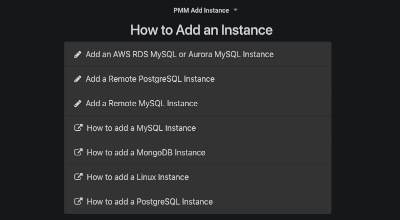
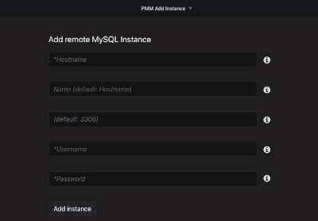
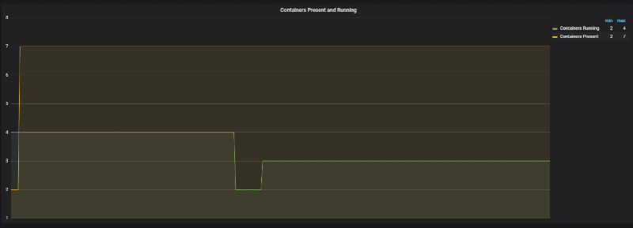

# Percona Monitoring and Management 1.16.0

* **Date**

    November 1, 2018


*PMM* ([Percona Monitoring and Management](../index.md)) is a free and open-source platform for managing and monitoring *MySQL*, *MongoDB*, and *PostgreSQL* performance. You can run *PMM* in your own environment for maximum security and reliability. It provides thorough time-based analysis for *MySQL* and *MongoDB* servers to ensure that your data works as efficiently as possible.

This release offers three new features for both the Community and Percona Customers:

* Agentless PMM support - Use PMM Server to gather Database Metrics and Queries from remote instances with no PMM Client installed!
* Query Analytics + Metric Series – See Related Database activity alongside queries
* Simplify metrics collections

We addressed 11 new features and improvements, and fixed 21 bugs.

## Agentless PMM support for MySQL and PostgreSQL

You’re now able to connect *PMM Server* to your *MySQL* and *PostgreSQL* instances, whether they run in a cloud DBaaS environment, or under Operating Systems which are not natively supported by *PMM* (e.g. Windows), or when you do not have shell access to the server. This can help you get up and running with *PMM* using minimal configuration and zero client installation, however be aware there are limitations - *there won’t be any host-level dashboards populated for these nodes* since we don’t attempt to connect to the provider’s API nor are we granted access to the instance in order to deploy an exporter.

### How to use

You’ll be able to collect Metrics and Queries from *MySQL*, and Metrics from *PostgreSQL*.  You can add remote instances by selecting the *PMM Add Instance* item in a PMM Dropdown group of the system menu:


where you will then have the opportunity to add a Remote MySQL or Remote
PostgreSQL instance:



You’ll add the instance by supplying just the Hostname, database Username and
Password (and optional Port and Name):



Also new as part of this release is the ability to display nodes you’ve added,
on screen **RDS and Remote Instances**:


### Server activity metrics in the PMM Query Analytics dashboard

The Query Analytics dashboard now shows host and database activity graphs linked to the queries listed in a summary table.  This brings a view of System Activity (CPU, Disk, and Network) and Database Server Activity (Connections, Queries per Second, and Threads Running) to help you better pinpoint query pileups and other bottlenecks.


### Extending metrics with node_exporter textfile collector

While *PMM* provides an excellent solution for system monitoring, sometimes you may have the need for a metric that’s not present in the list of `node_exporter` metrics out of the box. There is a simple method to extend the list of available metrics without modifying the `node_exporter` code. It is based on the textfile collector.  We’ve enabled this collector as on by default, and it is deployed as part of `linux:metrics` in *PMM Client*.

The default directory for reading text files with the metrics is `/usr/local/percona/pmm-client/textfile-collector`, and the exporter reads files from it with the `.prom` extension. By default it contains an example file  `example.prom` which has commented contents and can be used as a template.

You are responsible for running a cronjob or other regular process to generate the metric series data and write it to this directory.

#### Example – collecting docker container information

This example will show you how to collect the number of running and stopped docker containers on a host. It uses a `crontab` task, set with the following lines in the cron configuration file (e.g. in `/etc/crontab`):

```
*/1 * * * *     root   echo -n "" > /tmp/docker_all.prom; docker ps -a -q | wc -l | xargs echo node_docker_containers_total >> /usr/local/percona/pmm-client/docker_all.prom;
*/1 * * * *     root   echo -n "" > /tmp/docker_running.prom; docker ps | wc -l | xargs echo node_docker_containers_running_total >> /usr/local/percona/pmm-client/docker_running.prom;
```

The result of the commands is placed into the `docker_all.prom` and `docker_running.prom` files and read by exporter and will create two new metric series named `node_docker_containers_total` and `node_docker_containers_running_total`, which we’ll then plot on a graph:



## New Features and Improvements

* [PMM-3195](https://jira.percona.com/browse/PMM-3195): Remove Color scheme switch in favor of the UI Theme chooser in Preferences
* [PMM-3194](https://jira.percona.com/browse/PMM-3194): Change link for “Where do I get the security credentials for my Amazon RDS DB instance?”
* [PMM-3189](https://jira.percona.com/browse/PMM-3189): Include Remote MySQL & PostgreSQL instance logs into PMM Server logs.zip system
* [PMM-3166](https://jira.percona.com/browse/PMM-3166): Convert status integers to strings on ProxySQL Overview Dashboard – Thanks, [Iwo Panowicz](https://github.com/impimp) for  [https://github.com/percona/grafana-dashboards/pull/239](https://github.com/percona/grafana-dashboards/pull/239)
* [PMM-3133](https://jira.percona.com/browse/PMM-3133): Include Metric Series on Query Analytics Dashboard
* [PMM-3078](https://jira.percona.com/browse/PMM-3078): Generate warning “how to troubleshoot postgresql:metrics” after failed pmm-admin add postgresql execution
* [PMM-3061](https://jira.percona.com/browse/PMM-3061): Provide Ability to Monitor Remote MySQL and PostgreSQL Instances
* [PMM-2888](https://jira.percona.com/browse/PMM-2888): Enable Textfile Collector by Default in node_exporter
* [PMM-2880](https://jira.percona.com/browse/PMM-2880): Use consistent favicon (Percona logo) across all distribution methods
* [PMM-2306](https://jira.percona.com/browse/PMM-2306): Reconfigure instance automatically after the EBS volume size increase
* [PMM-1358](https://jira.percona.com/browse/PMM-1358): Improve Tooltips on Disk Space Dashboard – thanks, [Corrado Pandiani](https://www.percona.com/blog/author/corrado-pandiani/) for texts

## Fixed Bugs

* [PMM-3202](https://jira.percona.com/browse/PMM-3202): Cannot add remote PostgreSQL to monitoring without specified dbname
* [PMM-3186](https://jira.percona.com/browse/PMM-3186): Strange “Quick ranges” tag appears when you hover over documentation links on PMM Add Instance screen
* [PMM-3182](https://jira.percona.com/browse/PMM-3182): Some sections for MongoDB are collapsed by default
* [PMM-3171](https://jira.percona.com/browse/PMM-3171): Remote RDS instance cannot be deleted
* [PMM-3159](https://jira.percona.com/browse/PMM-3159): Problem with enabling RDS instance
* [PMM-3127](https://jira.percona.com/browse/PMM-3127): “Expand all” button affects JSON in all queries instead of the selected one
* [PMM-3126](https://jira.percona.com/browse/PMM-3126): Last check displays locale format of the date
* [PMM-3097](https://jira.percona.com/browse/PMM-3097): Update home dashboard to support PostgreSQL nodes in Environment Overview
* [PMM-3091](https://jira.percona.com/browse/PMM-3091): postgres_exporter typo
* [PMM-3090](https://jira.percona.com/browse/PMM-3090): TLS handshake error in PostgreSQL metric
* [PMM-3088](https://jira.percona.com/browse/PMM-3088): It’s possible to downgrade PMM from Home dashboard
* [PMM-3072](https://jira.percona.com/browse/PMM-3072): Copy to clipboard is not visible for JSON in case of long queries
* [PMM-3038](https://jira.percona.com/browse/PMM-3038): Error adding MySQL queries when options for mysqld_exporters are used
* [PMM-3028](https://jira.percona.com/browse/PMM-3028): Mark points are hidden if an annotation isn’t added in advance
* [PMM-3027](https://jira.percona.com/browse/PMM-3027): Number of vCPUs for RDS is displayed incorrectly – report and proposal from [Janos Ruszo](https://www.percona.com/blog/author/janos-ruszo/)
* [PMM-2762](https://jira.percona.com/browse/PMM-2762): Page refresh makes Search condition lost and shows all queries
* [PMM-2483](https://jira.percona.com/browse/PMM-2483): LVM in the PMM Server AMI is poorly configured/documented – reported by [Olivier Mignault](https://jira.percona.com/secure/ViewProfile.jspa?name=olivier%40ookla.com) and lot of people involved.  Special thanks to  [Chris Schneider](https://jira.percona.com/secure/ViewProfile.jspa?name=schneiderdba%40gmail.com) for checking with fix options
* [PMM-2003](https://jira.percona.com/browse/PMM-2003): Delete all info related to external exporters on pmm-admin list output

## How to get PMM Server

PMM is available for installation using three methods:

* [Docker Hub](https://hub.docker.com/r/percona/pmm-server/) – `docker pull percona/pmm-server` – [Documentation](../deploy/server/docker.md)
* [AWS Marketplace](https://aws.amazon.com/marketplace/pp/B077J7FYGX) – [Documentation](../deploy/server/ami.md)
* [Open Virtualization Format (OVF)](https://www.percona.com/downloads/pmm/) – [Documentation](../deploy/server/virtual-appliance.md)
