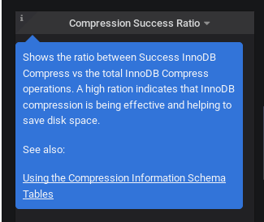

# Percona Monitoring and Management 1.17.2

* **Date**

    October 24, 2019

*PMM* ([Percona Monitoring and Management](https://www.percona.com/doc/percona-monitoring-and-management/index.html)) is a free and open-source platform for managing and monitoring *MySQL*, *MongoDB*, and *PostgreSQL* performance. You can run *PMM* in your own environment for maximum security and reliability. It provides thorough time-based analysis for *MySQL*, *MongoDB*, and *PostgreSQL* servers to ensure that your data works as efficiently as possible.

One of the improvements in this release is a substantial increase in available storage space for the AMI images, which allows now to reserve space for about 10 instances with 30 days retention.

**NOTE**: The size is increased for new installations only. The size of any existing installations can be increased [in the usual way](https://www.percona.com/doc/percona-monitoring-and-management/deploy/server/ami.html#run-server-ami-ebs-volume-resizing).

Another improvement is related to the Tooltips for the MySQL InnoDB Compression dashboard, which were updated by providing a description of what the graphs display, along with links to related documentation resources:

Besides these improvements, PMM 1.17.2 release provides fixes for a large number of vulnerabilities. Three fixed vulnerabilities have the Prototype Pollution type: CVE-2019-10747 (in set-value package), CVE-2019-10746 (in mixin-deep), and CVE-2019-10744 (inlodash). We have also fixed WS-2017-3737 (shelljs vulnerable to Command injection), CVE-2019-15043 (Grafana incorrect access control vulnerability), CVE-2019-8331 (possibility of the cross-site scripting in Bootstrap), WS-2019-0100 (fstream library vulnerable to Arbitrary File Overwrite), and CVE-2018-20834 (Improper Link Resolution Before File Access vulnerability in node-tar).

Also, PMM 1.17.2 is now based on Grafana 5.4.5.

In release 1.17.2 we have included 4 improvements and fixed 23 bugs:

## Improvements

* [PMM-3648](https://jira.percona.com/browse/PMM-3648): RHEL 8 PMM Client support
* [PMM-4311](https://jira.percona.com/browse/PMM-4311): Debian 10 Buster PMM Client support
* [PMM-2313](https://jira.percona.com/browse/PMM-2313): Configure AMI images for a 100GB disk instead of a 16GB one
* [PMM-3500](https://jira.percona.com/browse/PMM-3500): Update tooltips for the MySQL InnoDB Compression dashboard

## Fixed Bugs

* [PMM-3089](https://jira.percona.com/browse/PMM-3089): Problem with RDS after docker way upgrade
* [PMM-511](https://jira.percona.com/browse/PMM-511): Group all metrics on MongoDB Cluster Summary dashboard by the ‘replset’ label
* [PMM-2558](https://jira.percona.com/browse/PMM-2558): Wrong time format in MySQL Table Statistics dashboard
* [PMM-3251](https://jira.percona.com/browse/PMM-3251): SystemOverview dashboard had Min Space Available zero with squashfs mounted
* [PMM-3256](https://jira.percona.com/browse/PMM-3256): Not possible to modify the list of collected metrics
* [PMM-3389](https://jira.percona.com/browse/PMM-3389): Link on “Advanced Memory Details” was leading to the same dashboard
* [PMM-3497](https://jira.percona.com/browse/PMM-3497): Network chart “bits in /out” labels were in MiB, which is an abbreviation for bytes and not bits.
* [PMM-3515](https://jira.percona.com/browse/PMM-3515): PostgreSQL Overview dashboard Total Stats are empty if a database is selected
* [PMM-3655](https://jira.percona.com/browse/PMM-3655): Typos on ProxySQL Dashboard
* [PMM-3748](https://jira.percona.com/browse/PMM-3748): Gaps in two MySQL Overview graphs
* [PMM-3991](https://jira.percona.com/browse/PMM-3991): Active Connections chart had wrong values on the  PostgreSQL Overview dashboard
* [PMM-4146](https://jira.percona.com/browse/PMM-4146): “Error on ingesting out-of-order samples” in Prometheus log when hostname used by PMM dashboards had a dash or a dot symbol
* [PMM-4596](https://jira.percona.com/browse/PMM-4596): Grafana vulnerability allowed partial access to theGrafana HTTP API without being authenticated, making it possible to run a DoS attack against the server(CVE-2019-15043)
* [PMM-4604](https://jira.percona.com/browse/PMM-4604): set-value package vulnerable to Prototype Pollution (CVE-2019-10747)
* [PMM-4603](https://jira.percona.com/browse/PMM-4603): mixin-deep vulnerable to Prototype Pollution (CVE-2019-10746)
* [PMM-4337](https://jira.percona.com/browse/PMM-4337): lodash vulnerable to Prototype Pollution (CVE-2019-10744)
* [PMM-4253](https://jira.percona.com/browse/PMM-4253): shelljs vulnerable to Command injection (WS-2017-3737)
* [PMM-4212](https://jira.percona.com/browse/PMM-4212): fstream library vulnerable to Arbitrary File Overwrite (WS-2019-0100)
* [PMM-3976](https://jira.percona.com/browse/PMM-3976): Improper Link Resolution Before File Access vulnerability in node-tar package (CVE-2018-20834)
* [PMM-3549](https://jira.percona.com/browse/PMM-3549): Possibility of the cross-site scripting in Bootstrap (CVE-2019-8331)
* [PMM-4375](https://jira.percona.com/browse/PMM-4375): Trying to export metrics from a containerized standalone MongoDB caused the exporter runtime error
* [PMM-4370](https://jira.percona.com/browse/PMM-4370): pmm-client didn’t consider disabled mysql:metrics options and still tried to query the database
* [PMM-4367](https://jira.percona.com/browse/PMM-4367): PostgreSQL Overview dashboard was showing the wrong PostgreSQL version

Help us improve our software quality by reporting any Percona Monitoring and Management bugs you encounter using [our bug tracking system](https://jira.percona.com/secure/Dashboard.jspa).

## How to get PMM Server

PMM is available for installation using three methods:

* [Docker Hub](https://hub.docker.com/r/percona/pmm-server/) – `docker pull percona/pmm-server` – [Documentation](../deploy/server/docker.md)
* [AWS Marketplace](https://aws.amazon.com/marketplace/pp/B077J7FYGX) – [Documentation](../deploy/server/ami.md)
* [Open Virtualization Format (OVF)](https://www.percona.com/downloads/pmm/) – [Documentation](../deploy/server/virtual-appliance.md)
