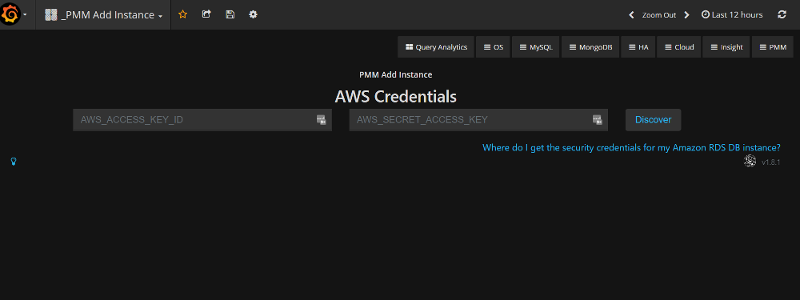
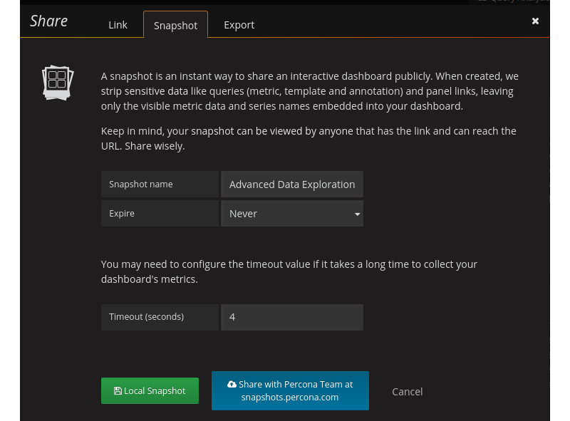
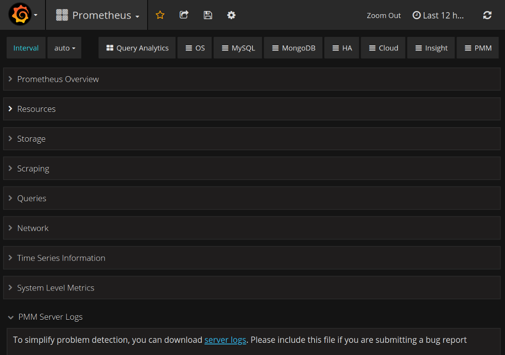
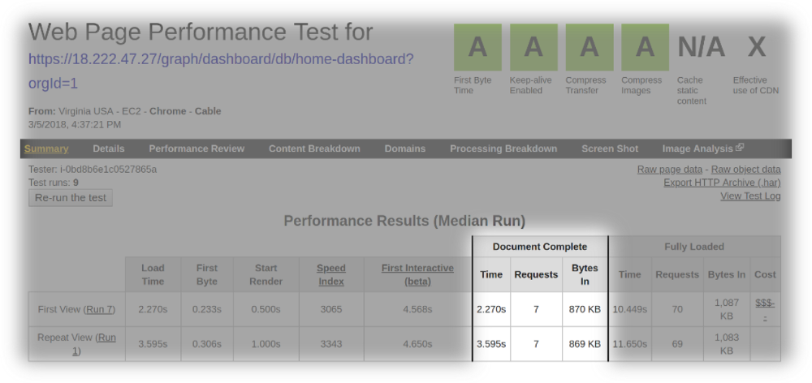

# *Percona Monitoring and Management* 1.9.0

* **Date**

    April 4, 2018

There are a number of significant updates in 1.9.0 that we hope you will like, some of the key highlights include:

* Faster loading of the index page: We have enabled performance optimizations using **gzip** and **HTTP2**.
* AWS improvements: We have added metrics from CloudWatch RDS to 6 dashboards, as well as changed our AWS add instance workflow, and made some changes to credentials handling.
* Percona Snapshot Server: If you are a Percona Customer you can now securely share your dashboards with Percona Engineers.
* Exporting PMM Server logs: Retrieve logs from PMM Server for troubleshooting using single button-click, avoiding the need to log in manually to the docker container.
* Low RAM support: We have reduced the memory requirement so PMM Server will run on systems with 512MB
* Dashboard improvements: We ave changed MongoDB instance identification for MongoDB graphs, and set maximum graph Y-axis on Prometheus Exporter Status dashboard

## AWS Improvements

### CloudWatch RDS metrics

Since we are already consuming Amazon Cloudwatch metrics and persisting them in Prometheus, we have improved 6 node-specific dashboards to now display Amazon RDS node-level metrics:

* Cross_Server (Network Traffic)
* Disk Performance (Disk Latency)
* Home Dashboard (Network IO)
* MySQL Overview (Disk Latency, Network traffic)
* Summary Dashboard (Network Traffic)
* System Overview (Network Traffic)

### AWS Add Instance changes

We have changed our AWS add instance interface and workflow to be more clear on information needed to add an Amazon Aurora MySQL or Amazon RDS MySQL instance. We have provided some clarity on how to locate your AWS credentials.


### AWS Settings

We have improved our documentation to highlight connectivity best practices, and authentication options - IAM Role or IAM User Access Key.

### Enabling Enhanced Monitoring


### Credentials Screen



## Low RAM Support

You can now run PMM Server on instances with memory as low as 512MB RAM, which means you can deploy to  the free tier of many cloud providers if you want to experiment with PMM.  Our memory calculation is now:

```
METRICS_MEMORY_MULTIPLIED=$(( (${MEMORY_AVAIABLE} - 256*1024*1024) / 100 * 40 ))
if [[ $METRICS_MEMORY_MULTIPLIED < $((128*1024*1024)) ]]; then
    METRICS_MEMORY_MULTIPLIED=$((128*1024*1024))
fi
```

## Percona Snapshot Server

Snapshots are a way of sharing PMM dashboards via a link to individuals who do not normally have access to your PMM Server.  If you are a Percona Customer you can now securely share your dashboards with Percona Engineers.  We have replaced the button for sharing to the Grafana publicly hosted platform onto one administered by Percona.  Your dashboard will be written to Percona snapshots and only Percona Engineers will be able to retrieve the data.  We will be expiring old snapshots automatically at 90 days, but when sharing you will have the option to configure a shorter retention period.



## Export of PMM Server Logs

In this release, the logs from PMM Server can be exported using single button-click, avoiding the need to log in manually to the docker container. This simplifies the troubleshooting process of a PMM Server, and especially for Percona Customers, this feature will provide a more consistent data gathering task that you will perform on behalf of requests from Percona Engineers.



## Faster Loading of the Index Page

In version 1.8.0, the index page was redesigned to reveal more useful information about the performance of your hosts as well an immediate access to essential components of PMM, however the index page had to load much data dynamically resulting in a noticeably longer load time. In this release we enabled **gzip** and **HTTP2** to improve the load time of the index page. The following screenshots demonstrate the results of our tests on <webpagetest.org> where we reduce page load time by half.  We will continue to look for opportunities to improve the performance of the index page and expect that when we upgrade to Prometheus 2 we will see another improvement.

### The load time of the index page of PMM version 1.8.0


### The load time of the index page of PMM version 1.9.0



## Issues in this release

### New Features

* [PMM-781](https://jira.percona.com/browse/PMM-781): Plot new PXC 5.7.17, 5.7.18 status variables on new graphs for PXC Galera, PXC Overview dashboards
* [PMM-1274](https://jira.percona.com/browse/PMM-1274): Export PMM Server logs as zip file to the browser
* [PMM-2058](https://jira.percona.com/browse/PMM-2058): Percona Snapshot Server

### Improvements

* [PMM-1587](https://jira.percona.com/browse/PMM-1587): Use `mongodb_up` variable for the MongoDB Overview dashboard to identify if a host is MongoDB.
* [PMM-1788](https://jira.percona.com/browse/PMM-1788): AWS Credentials form changes
* [PMM-1823](https://jira.percona.com/browse/PMM-1823): AWS Install wizard improvements
* [PMM-2010](https://jira.percona.com/browse/PMM-2010): System dashboards update to be compatible with RDS nodes
* [PMM-2118](https://jira.percona.com/browse/PMM-2118): Update grafana config for metric series that will not go above 1.0
* [PMM-2215](https://jira.percona.com/browse/PMM-2215): PMM Web speed improvements
* [PMM-2216](https://jira.percona.com/browse/PMM-2216): PMM can now be started on systems without memory limit capabilities in the kernel
* [PMM-2217](https://jira.percona.com/browse/PMM-2217): PMM Server can now run in Docker with 512 Mb memory
* [PMM-2252](https://jira.percona.com/browse/PMM-2252): Better handling of variables in the navigation menu

### Bug fixes

* [PMM-605](https://jira.percona.com/browse/PMM-605): **pt-mysql-summary** requires additional configuration
* [PMM-941](https://jira.percona.com/browse/PMM-941): ParseSocketFromNetstat finds an incorrect socket
* [PMM-948](https://jira.percona.com/browse/PMM-948): Wrong load reported by QAN due to mis-alignment of time intervals
* [PMM-1486](https://jira.percona.com/browse/PMM-1486): MySQL passwords containing the dollar sign ($) were not processed properly.
* [PMM-1905](https://jira.percona.com/browse/PMM-1905): In QAN, the Explain command could fail in some cases.
* [PMM-2090](https://jira.percona.com/browse/PMM-2090): Minor formatting issues in QAN
* [PMM-2214](https://jira.percona.com/browse/PMM-2214): Setting Send real query examples for Query Analytic OFF still shows the real query in example.
* [PMM-2221](https://jira.percona.com/browse/PMM-2221): no Rate of Scrapes for MySQL & MySQL Errors
* [PMM-2224](https://jira.percona.com/browse/PMM-2224): Exporter CPU Usage glitches
* [PMM-2227](https://jira.percona.com/browse/PMM-2227): Auto Refresh for dashboards
* [PMM-2243](https://jira.percona.com/browse/PMM-2243): Long host names in Grafana dashboards are not displayed correctly
* [PMM-2257](https://jira.percona.com/browse/PMM-2257): PXC/galera cluster overview Flow control paused time has a percentage glitch
* [PMM-2282](https://jira.percona.com/browse/PMM-2282): No data is displayed on dashboards for OVA images
* [PMM-2296](https://jira.percona.com/browse/PMM-2296): The `mysql:metrics` service will not start on Ubuntu LTS 16.04
